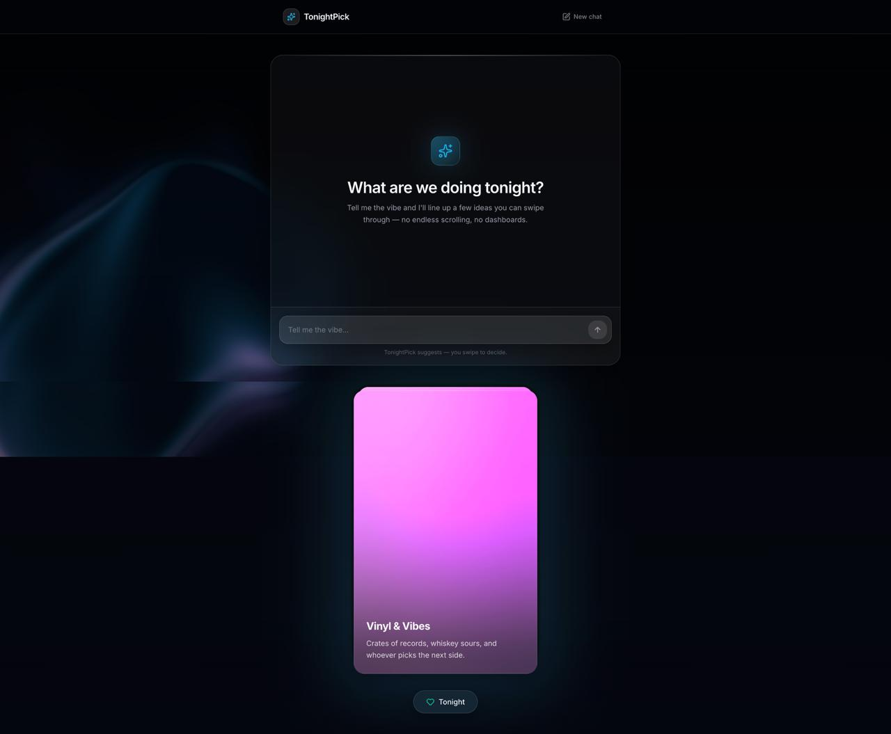

<div align="center">

# 🌙 TonightPick

**Tinder for your evening — one swipe, one plan, no dashboard.**

Swipe through activity ideas, shortlist your favourites, and let the app pick your plan for tonight. No feeds, no infinite scroll, no decision paralysis.

[](../../actions/workflows/ci.yml)
[](LICENSE)
[](https://react.dev)
[](https://www.typescriptlang.org)
[](https://tailwindcss.com)

[**Live Demo**](#) &nbsp;·&nbsp; [**Report a Bug**](../../issues/new?template=bug_report.yml) &nbsp;·&nbsp; [**Request a Feature**](../../issues/new?template=feature_request.yml)

</div>

---

## The problem

> *"It's 7pm. You have a free evening. You spend 40 minutes deciding what to do — and end up scrolling anyway."*

Decision fatigue is real. Group chats loop endlessly. Netflix fills the void.

TonightPick fixes the *choosing* problem, not the *options* problem.

---

## How it works

```
1. Create an evening  ──  enter a title + pick a mood (Home / Out / Friends)
2. Swipe cards        ──  Nope · Tonight · Again  (3 rerolls per session)
3. Pick a winner      ──  tap "Pick one for tonight" on your shortlist
```

Three screens. Two minutes. One concrete plan.

---

<div align="center">
  
</div>

---

## Quick start

### Frontend only — no backend required

```bash
cd frontend
npm install
npm run dev       # http://localhost:5173
```

Mock mode is on by default — the app runs fully offline with sample activity cards.

To toggle mock mode, create `frontend/.env.local`:

```env
VITE_USE_MOCK=true            # default — no backend needed
VITE_API_URL=http://localhost:3001
```

### Full stack (Docker)

```bash
make setup   # build images, start services, seed database (first run)
make up      # subsequent runs
```

| Service | URL |
|---------|-----|
| Frontend | http://localhost:5173 |
| API | http://localhost:3001 |

Run `make help` for all available targets.

---

## Tech stack

| Layer | Technology |
|-------|------------|
| Frontend | React 19 · Vite 8 · TypeScript (strict) · Tailwind CSS 4 · react-router-dom · framer-motion · lucide-react |
| Backend | Node/Express · Port 3001 |
| Infra | Docker Compose · Makefile · Rails 8.1 (API starter layer) |
| Quality | Oxlint · `tsc --noEmit` · GitHub Actions CI |

---

## Project structure

```
.
├── frontend/               # React + Vite SPA  ← start here
│   └── src/
│       ├── pages/          # HomePage · SwipePage · ResultsPage
│       ├── components/     # ActivityCard · SwipeActionBar · ui/
│       ├── api/            # client.ts + mock.ts (same function signatures)
│       ├── types/          # Activity · ActivityCard · Mood · Budget
│       └── hooks/          # useRerolls · useActivityTransition
├── backend/                # Rails 8.1 starter + TonightPick API (port 3001)
├── docs/                   # Full spec: API contract · UI spec · architecture
│   ├── api/reference.md    # canonical endpoint + type definitions
│   ├── design/ui-spec.md   # screen layouts, design tokens
│   └── development/        # frontend + backend dev guides
└── IMPLEMENTATION.md       # Handoff doc: screens · scoring · acceptance test
```

---

## API reference

Six endpoints on `http://localhost:3001`:

| Method | Path | Purpose |
|--------|------|---------|
| `GET` | `/health` | Liveness check |
| `POST` | `/events` | Create a swipe session |
| `GET` | `/events/:id/next` | Next activity card |
| `POST` | `/events/:id/swipe` | Record Nope or Tonight |
| `POST` | `/events/:id/reroll` | Again — new card, no decision recorded |
| `GET` | `/events/:id/liked` | Shortlist for Results screen |

Full contract with request/response shapes → [`docs/api/reference.md`](docs/api/reference.md)

---

## Development

```bash
# Frontend (recommended starting point)
cd frontend
npm run dev      # dev server with HMR
npm run build    # typecheck + production bundle
npm run lint     # Oxlint

# Full stack via Docker
make up          # start all services
make down        # stop all services
make logs        # follow all service logs
make help        # list every make target
```

---

## Documentation

| Topic | Link |
|-------|------|
| Product overview | [docs/product/overview.md](docs/product/overview.md) |
| API contract | [docs/api/reference.md](docs/api/reference.md) |
| UI specification | [docs/design/ui-spec.md](docs/design/ui-spec.md) |
| Frontend dev guide | [docs/development/frontend.md](docs/development/frontend.md) |
| Backend dev guide | [docs/development/backend.md](docs/development/backend.md) |
| Full implementation spec | [IMPLEMENTATION.md](IMPLEMENTATION.md) |

---

## Roadmap

- [ ] Live backend with persistent sessions
- [ ] Group mode — shared room, aggregate swipes  
- [ ] Smart scoring — mood + weather + budget weighting
- [ ] Share link — send session URL to friends
- [ ] AI-generated activity suggestions

---

## Contributing

Contributions are welcome — bug fixes, new activities, UI polish, or backend work.

See [CONTRIBUTING.md](CONTRIBUTING.md) to get started.

---

## License

[MIT](LICENSE) © TonightPick contributors
